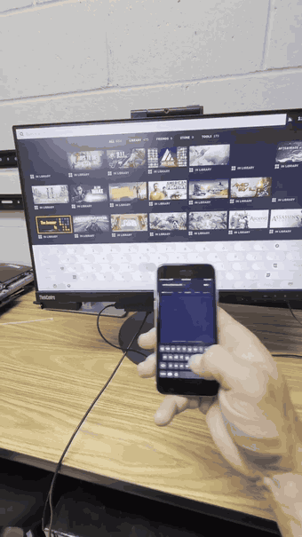
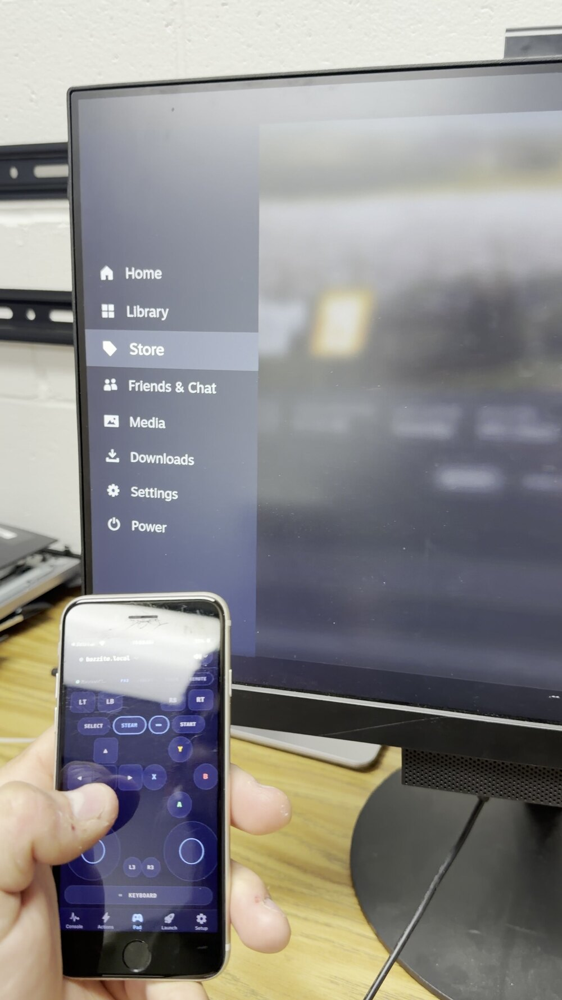

# Couchside

**Your phone is the dashboard, remote console, and game controller for your living-room Linux box.**

Couchside pairs a native iOS & Android app with a tiny, dependency-free Python service that runs on a SteamOS / Bazzite HTPC, a Steam Deck, or any systemd Linux machine. When gamescope wedges into a black screen and the TV shows nothing, Couchside is the screen: see live vitals, read the logs, restart the display session, or become an Xbox 360 controller, all from the couch and entirely on your own LAN. No cloud, no accounts, no analytics.

## See it in action

Real footage — a phone driving Steam Big Picture on the TV over the LAN, nothing staged.

| Navigate & switch input modes | Browse and launch the library |
| --- | --- |
|  |  |

| Type from the phone | Big Picture & Quick Access Menu |
| --- | --- |
|  |  |

The full install — one command, scan the QR, drive the box — is on the site: [couchside.tv](https://couchside.tv/#how) (terminal sped up, nothing else). Every release since launch is written up at [couchside.tv/updates](https://couchside.tv/updates/).

The gamepad UI on the phone and the Steam sidebar responding on the TV, at the same time:



## Features

- **Live console:** hostname, uptime, CPU temperature, load averages, memory and per-disk usage with color-coded bars, refreshed every few seconds. A big red BOX UNREACHABLE banner (with last-seen time) when the box drops off the network, which is exactly when you need it.
- **systemd unit health:** a watchlist of system and user units (display manager, the Couchside service itself, your own services) with active/failed state at a glance.
- **One-tap runbook actions:** grouped by what they interrupt, every action confirmed before it runs and *double*-confirmed when it ends your session:
  - **Restart display session** fixes the classic wedged-gamescope black screen without touching anything else.
  - **Reboot** / **Power off** are clean and fire-and-forget.
- **Journal viewer:** the last journald lines for any watchlist unit, newest first, straight from the phone.
- **Virtual game controller:** the service creates a real virtual **Xbox 360 pad** via `/dev/uinput`; games and Steam Big Picture see genuine wired-360 input. Four input modes, switchable with one tap:
  - **Gamepad:** full layout with dual analog sticks, D-pad, ABXY, bumpers, analog triggers, Start/Select/Guide, and haptic feedback.
  - **Swipe:** an Apple-TV-remote-style surface. Swipe to move through menus, tap to select, plus Back / Guide / Menu buttons. Perfect for Kodi and Big Picture navigation.
  - **Trackpad:** a relative-mouse trackpad with tap-to-click, two-finger right-click and scroll, for desktop sessions.
  - **Remote:** a classic TV-remote layout — a big circular D-pad with OK, Back/Menu/Home/Settings keys, volume and brightness rockers, and Steam/QAM shortcuts. On an RS-232 panel it adds input-source buttons and a BOX/TV toggle that drives either the box (as the virtual gamepad) or the TV's own factory remote over serial.
- **Pairing without typing:** tap **Scan for boxes** and Couchside finds them on your network; the one you pick shows a **PIN on its own screen** and you type that in. The installer's QR code still works, and host/port/token lives behind *Add by IP (advanced)* for anyone who wants it.
- **Multi-box Fleet:** pair as many machines as you like and switch between them from the Fleet tab — each remembers its own input mode and volume target.
- **Couch Mode:** hand a desktop session off to the TV and into Steam Game Mode from the phone, then back again.
- **Media keys and now-playing:** MPRIS transport control (play/pause/next/previous) with the current track surfaced in the app.
- **Stream from PC:** games another gaming PC offers over Steam Remote Play show up as tiles you can launch from the couch — they don't have to be installed on the box you're sitting in front of. A host that's switched off dims and says so (and can be hidden entirely), because a wrong "online" is exactly what makes Steam offer a multi-gigabyte install when you meant to stream.
- **What's running now:** a live card on Console for the game actually playing on the box, and a companion card for when the box is *serving* a stream to something else. Both read the machine's own state instead of asking you to remember what you started.
- **Steam's settings, one tap deep:** nineteen hardware-verified deep links into Steam's own settings panels — controller, display, audio, Wi-Fi and more — one swipe past the Remote on the Pad. Game Mode only, because that's the only place they do anything.
- **Hold the guide button to come to the couch:** a controller can start Couch Mode by itself, without picking up the phone.
- **Type and paste:** the keyboard bar has a **PASTE** button that sends your phone's clipboard straight to the box, and when the box raises its own on-screen keyboard your phone raises yours to match, so you can just start typing.
- **Steam download progress**, **live screen preview**, and an **aerial screensaver** you can start from the couch.
- **Controller handoff:** when a second phone joins a box you're already driving, it asks and you tap Pass — instead of silently stealing input.
- **Stay current from the couch:** the app can ask the box whether a newer signed release exists and — if you opted in at the box — install it, verifying the maintainer signature first.
- **Wake a sleeping box:** send a Wake-on-LAN magic packet from the phone, or have an **already-awake box wake a sleeping one** for you (the only route on iOS, where the OS blocks apps from broadcasting).
- **Volume, mute, and box power.** A control next to the device picker adjusts the box's own OS volume and mute (a real drag-to-set 0–100 slider on SteamOS/Bazzite). On an HDMI-CEC or RS-232 setup you can switch it to drive the TV/panel instead — and on an RS-232 panel, also switch the display's input source, blank the screen without cutting power to an OPS box, and pass factory-remote keys. The same control suspends the box and, once it is offline, wakes it back up with a Wake-on-LAN magic packet.

## Control your TV

Couchside can also drive a **networked smart TV directly** — no HDMI-CEC and no serial cable. Add one under **Setup → Boxes → Smart TV remote**: tap **Scan for TVs** and Couchside finds the sets on your network, so you don't have to hunt for an IP (you can still type one). Couchside identifies what is actually at an address *before* you try to pair with it, so aiming at the wrong device explains itself instead of just failing — and with more than one set on the network you choose which one the Pad drives, rather than getting whichever brand happens to rank highest. Once it's connected the Pad tab lights up with the D-pad, **power, volume, the input/SOURCE key**, and an on-screen keyboard — and your phone's own **volume buttons** drive the TV too.

- **LG webOS** — enter the TV's IP, then accept the pairing prompt that appears on the TV (once). An optional MAC address enables Wake-on-LAN power-on.
- **Samsung (Tizen)** _(beta — not yet validated on real hardware)_ — enter the IP, then approve the "Allow" prompt on the TV. Optional MAC for Wake-on-LAN.
- **Roku** — enter the IP; no pairing. **If the D-pad doesn't respond after adding, the Roku is blocking app control:** on the Roku, set _Settings → System → Advanced system settings → Control by mobile apps → Network access_ to **Permissive**.
- **Android / Google TV** — enter the IP, then type the 6-digit code the TV shows. Optional MAC for Wake-on-LAN.
- **Hisense (VIDAA)** — enter the IP, then approve the pairing code the TV displays. Note that Hisense sets running **Google TV** pair as Android / Google TV above, not as VIDAA.
- **LG commercial / signage panels** — the boardroom-and-hotel LG sets speak their own control protocol on a different port from consumer webOS, and are supported separately. No pairing prompt.

These network backends run on the Linux service. The Windows service supports **Roku** (from `0.3.6-win`); LG / Samsung / Google TV / Hisense are Linux-only for now. TV control also works **through the box** when it has an HDMI-CEC link or an RS-232 serial panel (power, volume, input source, on-screen remote) — see the volume/power control above.

## Requirements

- A **SteamOS, Bazzite, or other systemd-based Linux** machine on your home network (HTPC, Steam Deck in desktop/docked use, mini PC…). The service is pure Python 3 stdlib: no pip, and it works on immutable/ostree systems.
  - **Windows HTPC?** There's a Windows service with the same API ([`agent/win/`](agent/win/README.md)) — services, Event Log, Steam launching + Big Picture, volume, and a ViGEm virtual gamepad. Install it in one line from PowerShell: `irm https://couchside.tv/install.ps1 | iex`.
- An **iPhone or Android phone** on the same LAN.

## Install the service

On the box (or over SSH):

```sh
curl -fsSL https://couchside.tv/install.sh | bash
```

The installer copies the service to `~/.local/opt/couchside/`, generates a token at `/etc/couchside/token`, installs a scoped sudoers rule, enables `couchside.service`, opens `8787/tcp` in the local firewall, and finishes by printing a pairing QR code.

## Get the app

- **Android → [Google Play](https://play.google.com/store/apps/details?id=com.ets3d.rescueremote)** — available now.
- **iPhone / iPad → [App Store](https://apps.apple.com/app/id6786884115)** — available now.

Free 7-day trial with every feature unlocked, then a one-time unlock ($4.99 summer launch price). Prefer to build it yourself? The app's full source is right here: clone this repo and run it on your own device for personal use (see [app/LICENSE](app/LICENSE)).

## Pairing

**Scan + PIN (recommended):** on the Setup tab tap **Scan for boxes**. Couchside finds the boxes on your network, and the one you pick shows a **PIN on its own screen** — type that PIN into the app and it pairs itself. No IP, no port, no token to copy. The PIN appearing on the box's own display is the proof that you're the person sitting in front of it.

**QR:** point the phone camera at the QR code the installer prints. It's a `couchside://setup?host=…&port=…&token=…` deep link, so the app opens on the Setup tab with everything prefilled and runs a connection test automatically. Nothing is saved until you tap **SAVE**.

**Manual (advanced):** under **Add by IP (advanced)** enter the host (e.g. `mybox.local`), port (`8787`), and the contents of `/etc/couchside/token`, tap **TEST**, then **SAVE**.

## Security model

Couchside is deliberately small and boring about security:

- **Bearer token auth.** Every API route except the reachability ping requires `Authorization: Bearer <token>`; the gamepad WebSocket authenticates before the handshake completes. Comparisons are constant-time (`hmac.compare_digest`). The token file is `chmod 600`; on the phone it lives in the iOS Keychain / Android Keystore.
- **Scoped sudo, nothing more.** The installer writes a `visudo`-validated sudoers rule granting the service user passwordless sudo for exactly six fixed-argument commands: `systemctl restart sddm`, `systemctl reboot`, `systemctl poweroff`, `systemctl suspend`, `systemctl restart plugin_loader` (so the app can revive Decky Loader's panel, which dies whenever Steam's CEF restarts and never comes back on its own), and a root-owned journal wrapper. Nothing else. Note the last one carefully: the grant is for the **wrapper**, never for `journalctl` itself. The wrapper validates the unit and the line count and calls `journalctl` with a locked-down option set, because *any* wildcard rule on `journalctl` would also permit `--file` / `--directory` — turning "read the journal" into arbitrary file reads as root. The **privileged** actions are a fixed table; there is no route that runs an arbitrary command **as root**. Updating Flatpak apps or the OS from the app is an explicit **opt-in** (`couchside allow-system-updates on`, see the command table below) that adds a *separate* sudoers file granting **one fixed root-owned wrapper each** — never `flatpak` or `rpm-ostree` themselves, whose subcommands (install, run, override, rebase) would be arbitrary root. Off by default.
- **Launchers run as you, and creating them remotely is opt-in.** Beyond the fixed privileged actions, the app can *trigger* launchers — auto-discovered Steam games plus any custom commands the box owner defined. A launcher's command runs as the **desktop user, never root**. Because a custom launcher is an arbitrary command, *creating* one over the network is **off by default**: run `couchside allow-launchers on` to enable it, otherwise a bearer token can only trigger launchers you set up on the box, not mint new ones. (The same token can already synthesize keystrokes through the virtual gamepad, so treat the token as user-level trust on a machine you control — which is why it stays on your LAN.)
- **Journal access is allowlisted.** Only units on the configured watchlist can be read, with line counts clamped server-side, so a leaked token can't be used to trawl the whole system journal.
- **LAN-only by design.** The API is plain HTTP on port 8787 and is meant to stay on your local network. The firewall rule opens the port locally; **do not port-forward it**. There is no relay, no cloud endpoint, and the app never talks to anything except your service.
- No client-addressable file routes. The service serves image bytes on two routes only: the album-art image a running media player advertises (realpath-allowlisted, image-sniffed, 2 MiB cap; client passes a player id, never a path) and an on-demand screen-preview frame captured to a tmpfs file that's deleted right after (rate-clamped, off by default in the app). Subprocesses run with `shell=False`, errors return brief JSON, never tracebacks.

## The `couchside` command — enabling extra features

The installer adds a `couchside` command to manage the box. Most of it is
everyday (`couchside update`, `couchside status`, `couchside pair`), but three
subcommands are **opt-ins that are OFF by default** — they widen what a paired
phone is allowed to do, so you turn them on **only on the box**, never from the
app. Each prints exactly what it grants before it does anything.

| Command | What it lets the app do | Privilege it grants |
|---|---|---|
| `couchside allow-updates on` | Trigger a **Couchside agent** update from the app | none new — runs the signed installer the box already trusts |
| `couchside allow-system-updates on` | Update your box's **Flatpak apps and OS** (SteamOS/Bazzite) from the app | passwordless sudo for **one fixed command each** — a root-owned wrapper that runs `flatpak update --system` / stages an `rpm-ostree`/`steamos-update`, and accepts no other arguments. Never a grant on `flatpak`/`rpm-ostree` themselves. |
| `couchside allow-launchers on` | **Create** custom launchers from the app (not just trigger ones you defined) | none new — a launcher runs as your desktop user, never root |

Turn any of them off again with `... off`, or check state with `... status`.
An OS update **stages for the next boot** — the app shows "reboot to apply"
rather than pretending it finished. Nothing here can install new software or run
an arbitrary command as root: each grant is on a single fixed wrapper, validated
with `visudo`, and sorted last (`zz-couchside-updates`) so a distro's `wheel`
rule can't shadow it.

Full detail on why the grants are shaped this way is in the **Security model**
section above.

## Uninstall

```sh
curl -fsSL https://couchside.tv/install.sh | bash -s -- --uninstall
```

That removes the service, sudoers rule, udev/modules-load drop-ins, and the install dir (it asks before deleting the token). To do it by hand:

```sh
sudo systemctl disable --now couchside.service
sudo rm -rf /etc/couchside /etc/sudoers.d/couchside ~/.local/opt/couchside
sudo rm -f /etc/udev/rules.d/99-couchside-uinput.rules \
           /etc/modules-load.d/couchside-uinput.conf \
           /etc/systemd/network/50-couchside-wol.link
sudo rm -f /etc/systemd/system/couchside.service && sudo systemctl daemon-reload
```

Then delete the app from your phone.

## Development

```
agent/   couchsided.py: pure-stdlib Python 3 daemon (HTTP API + gamepad WebSocket)
agent/win/  Windows port of the service (same API; SendInput + ViGEmBus)
app/     Expo / React Native app for iOS & Android (tabs: Console, Fleet, Actions, Pad, Launch, Setup; the journal viewer lives inside Setup)
docs/    privacy policy, images
store/   App Store & Google Play metadata, review notes, screenshot plan
```

Develop the app without hardware using the service's mock mode on your Mac:

```sh
python3 agent/couchsided.py --mock --host 127.0.0.1 --port 8787 --token devtoken
```

Mock mode serves believable fake data and never executes real commands. The HTTP API and the `/ws/gamepad` WebSocket protocol (v2) are documented in [`agent/README.md`](agent/README.md).

## Pricing & license

**The service is free and open source. The app's source is public. The official app builds are a free 7-day trial, then a one-time unlock: $4.99 summer launch price, rising to $7.99 on September 1.**

- **Service, installer, brand, docs: MIT.** Use them anywhere, for anything — including building your own client against the protocol. See [LICENSE](LICENSE).
- **The mobile app (`app/`): source-available under the PolyForm Noncommercial License 1.0.0.** Read it, audit it, `npx expo run:ios` / `npx expo run:android` it onto your own phone, and modify it for personal, noncommercial use. What you can't do is sell it or redistribute it commercially. See [app/LICENSE](app/LICENSE). The trial gate ships in this public source; self-built personal copies without a store build are treated as unlocked by design, and that's fine.
- **The official builds on the [App Store](https://apps.apple.com/app/id6786884115) and [Google Play](https://play.google.com/store/apps/details?id=com.ets3d.rescueremote) are free to download** with everything unlocked for 7 days, then a **one-time in-app unlock: $4.99 through the summer, rising to $7.99 on September 1**. No subscription, no accounts. Unlock before September 1 to keep a permanent **Early Adopter** badge. You're paying for signed, notarized, auto-updating builds and a setup that goes from `curl` to couch in under ten minutes. It's also the only funding this project has, so thank you.

© 2026 Taylor Emery (ETS3D LLC).
